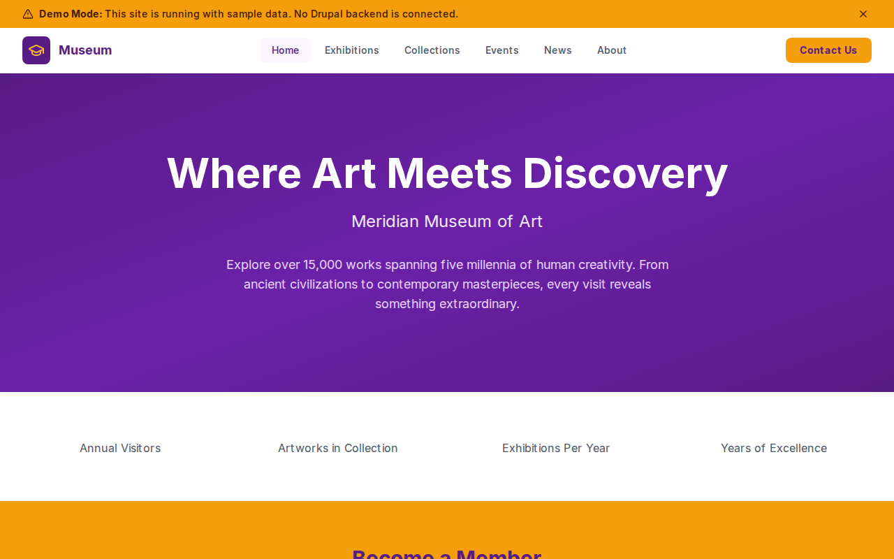

# Decoupled Museum

A museum and cultural institution website starter template for Decoupled Drupal + Next.js. Built for art museums, history museums, science centers, galleries, and cultural organizations that need to showcase exhibitions, permanent collections, events, and institutional news.



## Features

- **Exhibitions** - Current and upcoming exhibitions with dates, curators, gallery locations, and admission info
- **Permanent Collection** - Artworks and artifacts with artist details, medium, dimensions, and accession numbers
- **Museum Events** - Workshops, lectures, tours, and programs with ticketing and registration
- **News & Announcements** - Museum news, acquisitions, and press releases with categories
- **Homepage** - Hero section with museum statistics, featured exhibitions, and visitor CTA
- **Static Pages** - About, visit, membership, and other informational pages
- **Modern Design** - Elegant, accessible UI optimized for cultural institution content

## Quick Start

### 1. Clone the template

```bash
npx degit nextagencyio/decoupled-museum my-museum
cd my-museum
npm install
```

### 2. Run interactive setup

```bash
npm run setup
```

This interactive script will:
- Authenticate with Decoupled.io (opens browser)
- Create a new Drupal space
- Wait for provisioning (~90 seconds)
- Configure your `.env.local` file
- Import sample content

### 3. Start development

```bash
npm run dev
```

Visit [http://localhost:3000](http://localhost:3000)

---

## Manual Setup

If you prefer to run each step manually:

<details>
<summary>Click to expand manual setup steps</summary>

### Authenticate with Decoupled.io

```bash
npx decoupled-cli@latest auth login
```

### Create a Drupal space

```bash
npx decoupled-cli@latest spaces create "My Museum"
```

Note the space ID returned (e.g., `Space ID: 1234`). Wait ~90 seconds for provisioning.

### Configure environment

```bash
npx decoupled-cli@latest spaces env 1234 --write .env.local
```

### Import content

```bash
npm run setup-content
```

This imports:
- Homepage with hero image, statistics, and CTAs
- 3 Exhibitions (with dates, curators, and gallery locations)
- 3 Collection Items (paintings, sculpture, photography with artist details)
- 3 Events (workshops, lectures, family programs)
- 3 News Articles (acquisitions, openings, announcements)
- 3 Static Pages (About, Visit, Membership)

</details>

## Content Types

### Exhibition
- Title, Body (detailed description), Subtitle
- Featured Image, Gallery Images
- Start Date, End Date
- Gallery Location, Admission Info
- Curator
- Exhibition Type (taxonomy: Permanent, Temporary, Traveling, Interactive, Virtual)

### Collection Item
- Title, Body (provenance and description)
- Primary Image, Additional Images
- Artist/Creator, Date Created
- Medium, Dimensions
- Accession Number
- Category (taxonomy: Paintings, Sculpture, Photography, Textiles, etc.)
- Currently on Display (boolean)

### Event
- Title, Body (event details)
- Event Image
- Event Date, End Time
- Location, Ticket Price
- Registration URL, Audience
- Event Category (taxonomy)

### News
- Title, Body (article content)
- Featured Image, Summary
- Published Date, Author
- Category (taxonomy)

### Homepage
- Hero Title, Subtitle, Description, Hero Image
- Statistics (paragraph items with number and label)
- Featured Items Title
- CTA Title, Description, Primary and Secondary buttons

## Customization

### Colors & Branding
Edit `tailwind.config.js` to customize colors, fonts, and spacing.

### Content Structure
Modify `data/museum-content.json` to add or change content types and sample content.

### Components
React components are in `app/components/`. Update them to match your design needs.

## Demo Mode

Demo mode allows you to showcase the application without connecting to a Drupal backend. It displays mock content for the homepage, exhibitions, collections, events, and news.

### Enable Demo Mode

Set the environment variable:

```bash
NEXT_PUBLIC_DEMO_MODE=true
```

Or add to `.env.local`:
```
NEXT_PUBLIC_DEMO_MODE=true
```

### What Demo Mode Does

- Shows a "Demo Mode" banner at the top of the page
- Returns mock data for all GraphQL queries
- Displays sample exhibitions, collection items, events, and news
- No Drupal backend required

### Removing Demo Mode

To convert to a production app with real data:

1. Delete `lib/demo-mode.ts`
2. Delete `data/mock/` directory
3. Delete `app/components/DemoModeBanner.tsx`
4. Remove `DemoModeBanner` from `app/layout.tsx`
5. Remove demo mode checks from `app/api/graphql/route.ts`

## Deployment

### Vercel (Recommended)
[](https://vercel.com/new/clone?repository-url=https://github.com/nextagencyio/decoupled-museum)

Set `NEXT_PUBLIC_DEMO_MODE=true` in Vercel environment variables for a demo deployment.

### Other Platforms
Works with any Node.js hosting platform that supports Next.js.

## Documentation

- [Decoupled.io Docs](https://www.decoupled.io/docs)
- [Next.js Documentation](https://nextjs.org/docs)
- [Drupal GraphQL](https://www.decoupled.io/docs/graphql)

## License

MIT
